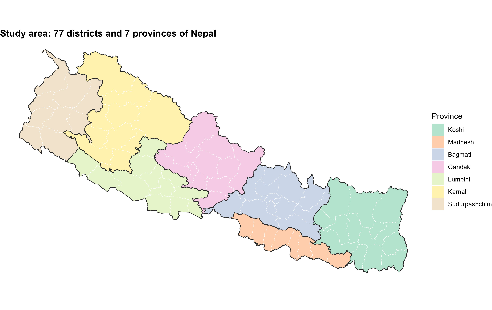
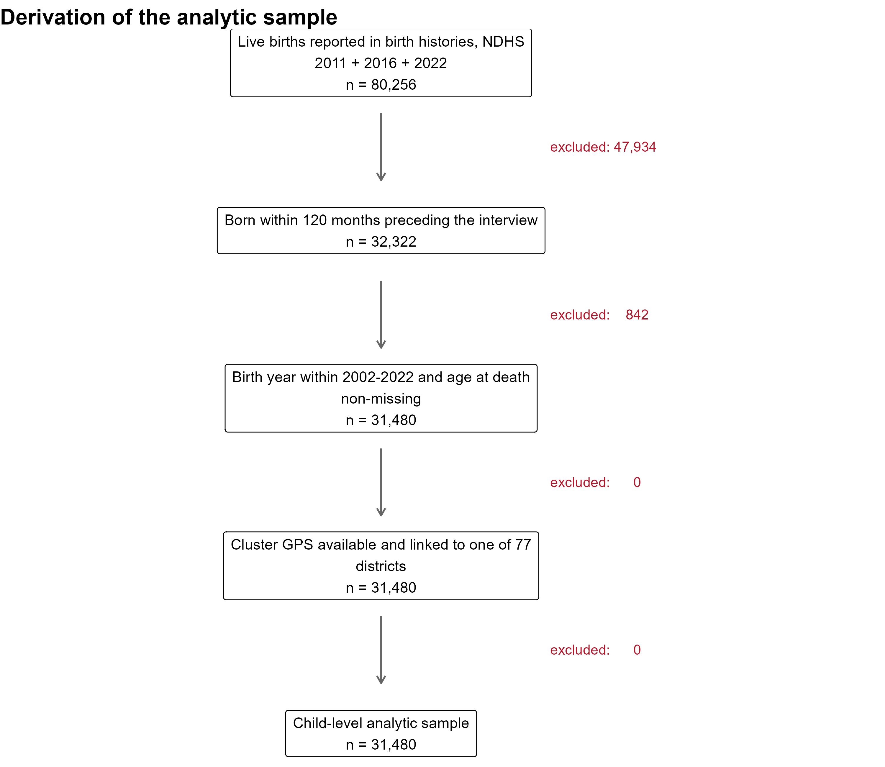
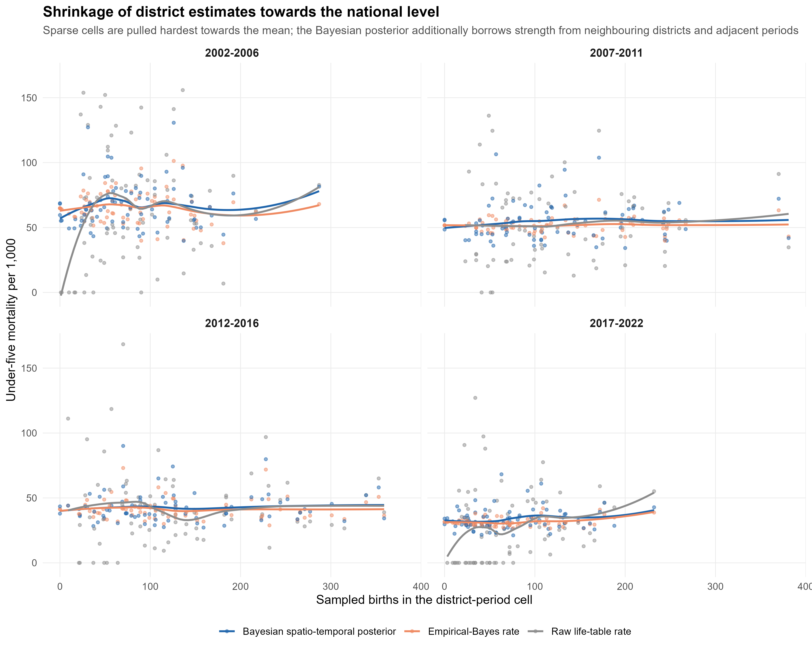
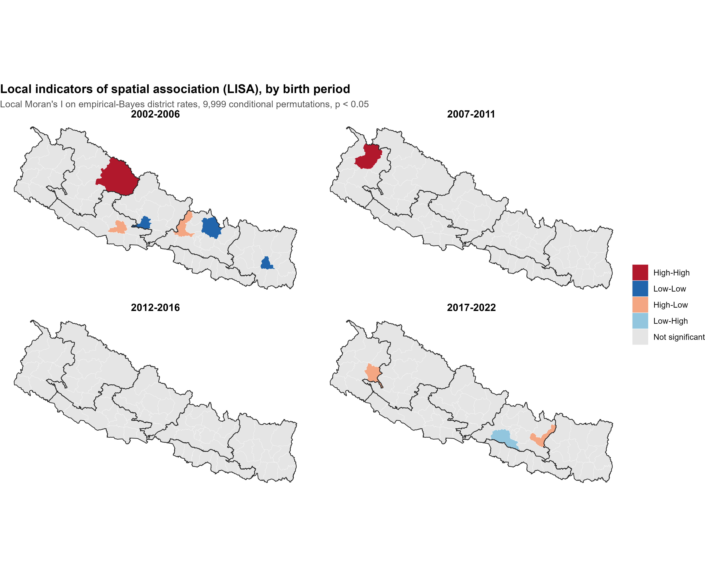
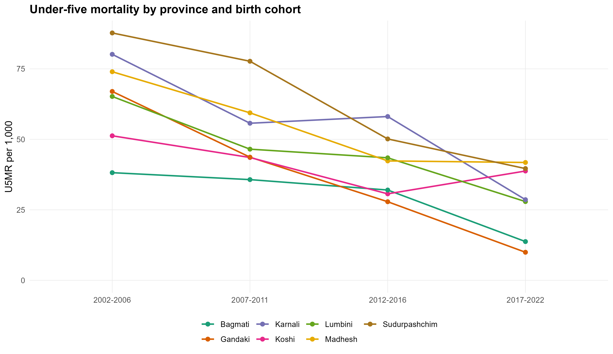
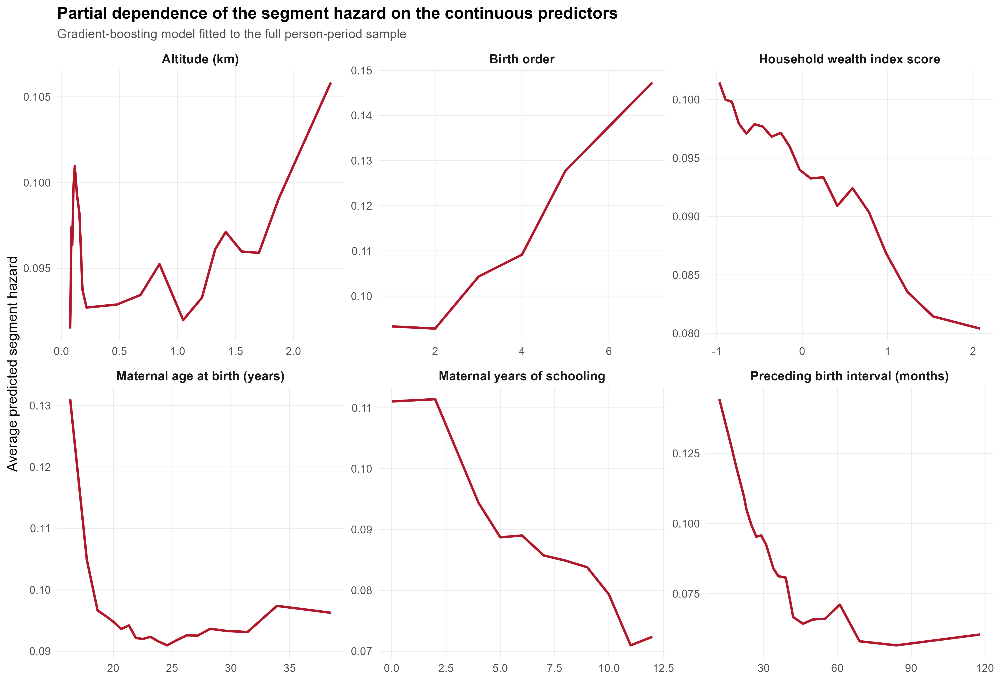

```{r setup}
#| include: false
library(dplyr); library(knitr); library(tidyr); library(flextable)
## Tables as real Word tables (as in the manuscript): the caption is the first
## header row, because Quarto drops a flextable caption in Word output.
tbl <- function(df, caption) {
  flextable(df) |> theme_booktabs() |>
    font(fontname = "Times New Roman", part = "all") |> fontsize(size = 9, part = "all") |>
    bold(part = "header") |> padding(padding.top = 1, padding.bottom = 1, part = "all") |>
    set_table_properties(layout = "autofit", width = 1, opts_word = list(split = FALSE)) |>
    add_header_lines(caption) |> bold(i = 1, part = "header") |>
    align(i = 1, part = "header", align = "left") |> fontsize(i = 1, size = 10, part = "header") |>
    hline(i = 1, part = "header", border = officer::fp_border(color = "black", width = 1))
}

## "Wealth quintile: Poorest" reads badly when the variable name repeats down a
## whole block. Split it into a Characteristic column printed once per block and
## a Category column, the same shape as Table 1.
split_term <- function(df, col = "Term") {
  parts <- strsplit(as.character(df[[col]]), ": ", fixed = TRUE)
  ch <- vapply(parts, function(p) if (length(p) > 1) p[1] else "", character(1))
  ca <- vapply(parts, function(p) if (length(p) > 1) paste(p[-1], collapse = ": ") else p[1],
               character(1))
  cbind(data.frame(Characteristic = ifelse(duplicated(ch) & nzchar(ch), "", ch),
                   Category = ca, check.names = FALSE),
        df[setdiff(names(df), col)])
}

PROJ <- Sys.getenv("U5M_PROJ",
                   "D:/khoj_nso/NP-Under-Five-Mortality/u5m_ml_spatiotemporal")
RES <- file.path(PROJ, "results"); TAB <- file.path(RES, "tables")
rd <- function(f, dir = RES) read.csv(file.path(dir, f), check.names = FALSE)
tb <- function(f) rd(paste0(f, ".csv"), TAB)
f1 <- function(x) formatC(as.numeric(x), format = "f", digits = 1)
f2 <- function(x) formatC(as.numeric(x), format = "f", digits = 2)
f3 <- function(x) formatC(as.numeric(x), format = "f", digits = 3)
tidy_district <- function(x) gsub("_[wW]\\b", " West", gsub("_[eE]\\b", " East", x))
tidy_term <- function(x) {
  x |>
    sub("^scale\\((.*)\\)$", "\\1", x = _) |>
    sub("^sex", "Sex: ", x = _) |>
    sub("^multiple", "Birth type: ", x = _) |>
    sub("^birth_order", "Birth order: ", x = _) |>
    sub("^bi_cat", "Preceding birth interval: ", x = _) |>
    sub("^mage_cat", "Maternal age at birth: ", x = _) |>
    sub("^medu", "Maternal education: ", x = _) |>
    sub("^wealth", "Wealth quintile: ", x = _) |>
    sub("^ethnicity", "Caste/ethnicity: ", x = _) |>
    sub("^residence", "Residence: ", x = _) |>
    sub("^period", "Birth cohort: ", x = _) |>
    sub("^water_imp", "Drinking water: ", x = _) |>
    sub("^sanit_imp", "Sanitation: ", x = _) |>
    sub("^electricity", "Electricity: ", x = _) |>
    sub("^clean_fuel", "Cooking fuel: ", x = _) |>
    sub("^hh_env", "Household environment: ", x = _) |>
    sub("^media", "Media exposure: ", x = _) |>
    sub("^mwork", "Maternal employment: ", x = _) |>
    sub("^hh_head_f", "Household head: ", x = _)
}
```



# S1. Sample, study area and analytic design

```{r}
tbl(tb("tableS_sample_flow"),
    caption = "Table S1. Derivation of the analytic sample from the pooled birth histories of the 2011, 2016 and 2022 Nepal Demographic and Health Surveys.")
```

{width=6.3in}

{width=6.3in}

Each child was followed from birth until death, the fifth birthday or interview,
whichever came first, and contributed one record for every DHS life-table age
segment it entered (0, 1–2, 3–5, 6–11, 12–23, 24–35, 36–47 and 48–59 months).
A child enters a segment if it lived beyond the segment's lower boundary. A
child who died is also counted in the segment in which the death occurred,
including deaths recorded exactly at a segment boundary. Exposure within a
segment is the part of the segment that the child was observed.
Fig S3 illustrates the construction with records from the analytic sample.

{width=6.3in}

## S1.1 The Bikram Sambat calendar

All century-month codes (CMC) in the Nepal DHS recodes are expressed in the
Bikram Sambat (BS) calendar:

$$\text{CMC}_{BS} = (\text{BS year} - 1900) \times 12 + \text{BS month},$$

where month 1 (Baisakh) begins around 13–14 April of Gregorian year
$\text{BS} - 57$. Differences between two CMCs — ages, exposure and preceding
birth intervals — do not depend on the calendar. Calendar years were converted
as

$$\text{Gregorian decimal year} = (\text{BS year} - 57) + 0.2849 + \frac{\text{BS month} - 0.5}{12},$$

where 0.2849 is the fraction of the Gregorian year elapsed on 14 April.

## S1.2 Household variables not recorded for visiting women

Drinking-water source, sanitation, cooking fuel and electricity carry DHS code
97 ("not a de jure resident") for women interviewed in a household of which they
were not usual members. The same children are affected in all four variables.
These children were retained with an explicit "not recorded" category. In the
individual-level Bayesian and survey-weighted models, the four identical
indicators were replaced by a single household-survey indicator, and the four
environmental contrasts were estimated among surveyed households.

# S2. Validation of mortality estimates

```{r}
tbl(tb("tableS_validation"),
    caption = "Table S2. Mortality for births in the five years before each survey, estimated from the analytic file, compared with the published NDHS key indicators (per 1,000 live births).")
```

Published NDHS estimates are period (synthetic-cohort) rates for the five
calendar years before the survey. The estimates here follow the births of the
same window as a cohort, with follow-up ending at interview. Small differences
are therefore expected.

# S3. Additional spatial results

```{r}
tbl(rd("moran_global.csv") |>
        transmute(Stratum = stratum, Rate = rate,
                  `Moran's I` = f3(moran_I), `p (Moran)` = f3(moran_p),
                  `Geary's C` = f3(geary_C), `p (Geary)` = f3(geary_p),
                  `EB index` = ifelse(is.na(eb_index), "–", f3(eb_index)),
                  `p (EB index)` = ifelse(is.na(eb_p), "–", f3(eb_p))),
    caption = "Table S3. Global spatial autocorrelation of crude and empirical-Bayes district under-five mortality, pooled and by birth cohort (9,999 permutations).")
```

&nbsp;

```{r}
tbl(tb("tableS_getis_counts"),
    caption = "Table S4. Number of Getis–Ord Gi* hot- and cold-spot districts by stratum, at p < 0.05 and after Benjamini–Hochberg false discovery rate (FDR) control.")
```

{width=6.3in}

{width=6.3in}

{width=6.3in}

# S4. Bayesian spatio-temporal model

```{r}
tbl(tb("table7b_variance_components"),
    caption = "Table S5. Posterior hyperparameters of the selected spatio-temporal model.")
```

&nbsp;

```{r}
tbl(tb("table8_highest_burden"),
    caption = "Table S6. Districts with the highest posterior relative risk in the most recent birth cohort.")
```

&nbsp;

```{r}
tbl(rd("inla_district_rr.csv") |>
        transmute(District = tidy_district(district), Province = province,
                  Cohort = period, Births = births, Deaths = deaths,
                  `Posterior U5MR` = f1(u5mr_smooth),
                  `95% CrI` = paste0(f1(u5mr_smooth_lo), "–", f1(u5mr_smooth_hi)),
                  RR = f2(rr), `P(RR > 1.2)` = f2(p_exceed_1_2)) |>
        arrange(District, Cohort),
    caption = "Table S7. Posterior under-five mortality per 1,000 live births, relative risk (RR) and exceedance probability for every district and birth cohort. Births and deaths are unweighted sample counts.")
```

&nbsp;

```{r}
tbl(tb("table7c_convergence"),
    caption = "Table S8. Dispersion of posterior mean district relative risks by birth cohort. Posterior means are shrunk more strongly in cohorts with fewer births; Table 6 in the main text reports dispersion with full posterior uncertainty.")
```

# S5. Machine learning

Model settings were chosen by random search within the training set. The
training set was divided into ten groups of children. Each configuration was
trained on nine groups and scored on the tenth, for five of the ten groups. The
setting with the highest area under the precision-recall curve (AUPRC) was
chosen.

```{r}
tune <- rd("ml_tuning.csv")
tbl(tune |> filter(learner == "Gradient boosting") |>
        select(max_depth, eta, subsample, colsample, min_child_weight,
               scale_pos_weight, nrounds, roc_auc, pr_auc) |>
        mutate(across(c(roc_auc, pr_auc), f3)),
    caption = "Table S9. Random-search configurations and cross-validated performance, gradient boosting.")
```

&nbsp;

```{r}
tbl(tune |> filter(learner == "Random forest") |>
        select(num_trees, mtry, min_node, max_depth, sample_fraction,
               pos_weight, roc_auc, pr_auc) |>
        mutate(across(c(roc_auc, pr_auc), f3)),
    caption = "Table S10. Random-search configurations and cross-validated performance, random forest.")
```

&nbsp;

```{r}
tbl(tb("tableS_spatial_cv"),
    caption = "Table S11. Leave-one-province-out validation: each province is predicted by models trained on the other six.")
```

&nbsp;

```{r}
tbl(rd("ml_recalibration.csv") |>
        transmute(Model = learner, `Positive-class weight` = weight_used,
                  `Scaling intercept` = f3(intercept), `Scaling slope` = f3(slope)),
    caption = "Table S12. Platt scaling of the class-weighted tree models, fitted to training-set out-of-fold predictions.")
```

&nbsp;

```{r}
tbl(rd("ml_calibration_slope.csv") |>
        transmute(Model = learner,
                  `Calibration intercept` = f3(calib_intercept),
                  `Calibration slope` = f3(calib_slope)),
    caption = "Table S13. Calibration intercept and slope on the held-out test set after recalibration (ideal values 0 and 1).")
```

&nbsp;

```{r}
tbl(tb("table6b_shap_importance"),
    caption = "Table S14. Global predictor importance: mean absolute SHAP value from the gradient-boosting model.")
```

{width=6.3in}

# S6. Individual-level model: additional output and sensitivity analyses

```{r}
tbl(tb("tableS_individual_hyper"),
    caption = "Table S15. Posterior hyperparameters of the individual-level Bayesian discrete-time survival model.")
```

&nbsp;

```{r}
tbl(tb("tableS_mor"),
    caption = "Table S16. Median odds ratios between districts and between survey clusters after adjustment for all covariates, with 95% credible intervals.")
```

&nbsp;

```{r}
tbl(split_term(tb("tableS_sensitivity")),
    caption = "Table S17. Sensitivity analyses: adjusted odds ratios (95% credible intervals) from the main model, from the model restricted to births in the five years before interview, and from the model additionally including children ever born and household size (per standard deviation). Age-segment terms are omitted.")
```

&nbsp;

```{r}
tbl(rd("svy_logistic.csv") |>
        filter(term != "(Intercept)", !grepl("^seg_f", term)) |>
        transmute(Term = tidy_term(term), OR = f2(estimate),
                  `95% CI` = paste0(f2(conf.low), "–", f2(conf.high)),
                  p = ifelse(p.value < 0.001, "<0.001", f3(p.value))) |>
        split_term(),
    caption = "Table S18. Survey-weighted logistic regression for death within an age segment, with design-based standard errors accounting for strata and survey-specific clusters.")
```

&nbsp;

```{r}
tbl(rd("inla_residual_district.csv") |>
        transmute(District = tidy_district(district), Province = province,
                  `Residual OR` = f2(resid_or), `95% CrI` = paste0(f2(lo), "–", f2(hi))),
    caption = "Table S19. Residual district odds ratios from the individual-level model after adjustment for all covariates.")
```

# S7. Software

```{r}
pv <- function(p) tryCatch(as.character(utils::packageVersion(p)), error = function(e) "–")
tbl(data.frame(
  Purpose = c("Statistical computing", "Spatial data", "Spatial statistics",
              "Bayesian inference", "Survey estimation", "Penalised regression",
              "Random forest", "Gradient boosting", "SHAP values", "Performance metrics"),
  Software = c("R", "sf", "spdep", "INLA", "survey", "glmnet",
               "ranger", "xgboost", "shapviz", "yardstick"),
  Version = c(paste(R.version$major, R.version$minor, sep = "."),
              pv("sf"), pv("spdep"), pv("INLA"), pv("survey"), pv("glmnet"),
              pv("ranger"), pv("xgboost"), pv("shapviz"), pv("yardstick"))),
  caption = "Table S20. Software and package versions.")
```

The analysis is organised as numbered R scripts, run in sequence by
`run_all.R`. One fixed random seed controls every random step: the
training/test split, the cross-validation folds, the model search, the
permutation tests, the bootstrap and the Monte Carlo replications.
